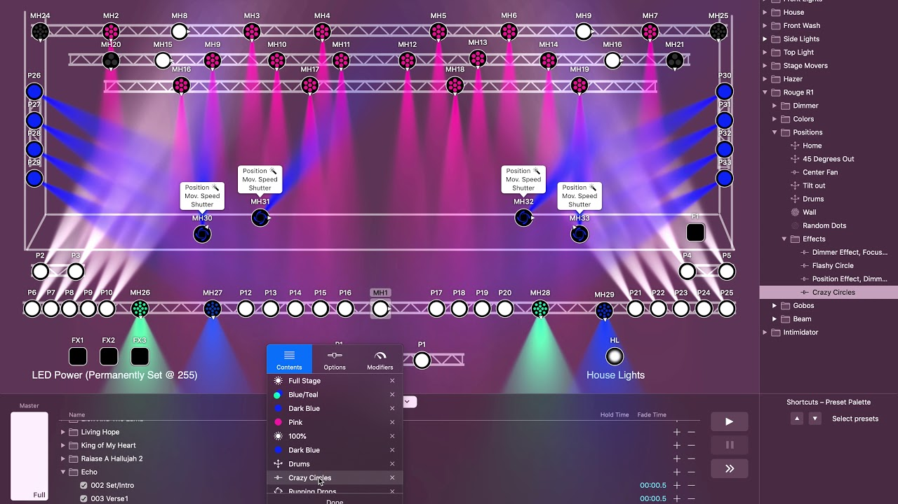
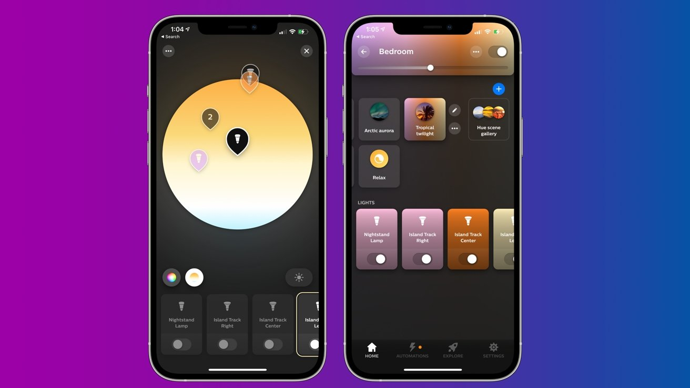
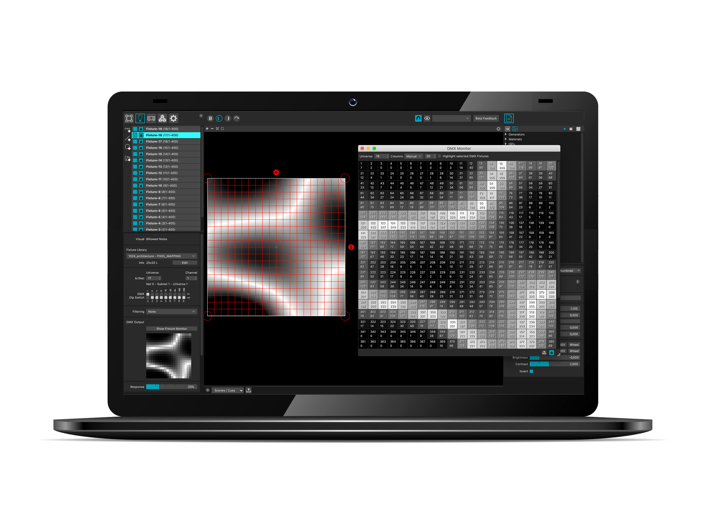

In this post, we'll explore the top lighting software recommendations for professionals in the
industry. Whether you're working on stage productions, home automation, or large-scale LED
installations, there's a solution tailored to your needs. Let's dive into the world of lighting
control protocols and the software that makes them shine.

## Understanding Lighting Protocols

Before we jump into specific software recommendations, it's crucial to understand the different
lighting protocols used in various settings.

### DMX for Stage Lighting

DMX (Digital Multiplex) is the industry standard for controlling stage lighting and effects. It
allows for precise control of up to 512 channels per universe, making it ideal for complex lighting
setups in theaters, concerts, and other live events.

### Hue and Zigbee for Ambient/Home Lighting

For home and ambient lighting, protocols like Philips Hue (which uses Zigbee) have become
increasingly popular. These systems offer wireless control, color-changing capabilities, and
integration with smart home ecosystems, providing both convenience and ambiance for residential and
commercial spaces.

### Art-Net for Individually Addressable LEDs

Art-Net is a protocol used for controlling large numbers of DMX universes over Ethernet networks.
It's particularly useful for installations with individually addressable LEDs, allowing for
intricate and dynamic lighting designs on a massive scale.

## Top Software Recommendations

Now that we've covered the basics of lighting protocols, let's explore some of the best software
options for professionals in different lighting domains.

### 1. LightKey for DMX Control

LightKey is a powerful and intuitive DMX lighting control software designed for Mac users. It offers
a user-friendly interface that allows for quick programming and live control of lighting fixtures.
Key features include:

- Real-time visualization of your lighting setup
- Extensive fixture library
- Timeline-based programming for complex shows
- MIDI and OSC support for external control

LightKey is an excellent choice for small to medium-sized productions, offering professional-grade
features at an accessible price point.

### 2. Philips Hue App for Home Lighting

When it comes to smart home lighting, the Philips Hue ecosystem is hard to beat. The Hue app
provides intuitive control over your Hue lights, allowing you to:

- Create and save custom scenes
- Set up routines and schedules
- Sync lights with music and entertainment
- Integrate with voice assistants and other smart home platforms

While primarily designed for home use, the Hue system can also be effectively employed in small
commercial spaces like cafes or boutiques to create inviting atmospheres.

### 3. madMapper by GarageCube for Addressable LEDs

For those working with large-scale LED installations, madMapper by GarageCube is a go-to solution.
This powerful software is designed for video mapping and LED pixel mapping, making it ideal for
controlling massive arrays of individually addressable LEDs using Art-Net and other protocols.
madMapper offers:

- Advanced 2D and 3D mapping capabilities
- Real-time effects and compositing
- Support for multiple input and output protocols
- Intuitive interface for complex projections and LED setups

madMapper is the tool of choice for many professionals creating immersive light art installations,
architectural lighting, and large-scale event productions. Its versatility allows it to handle
everything from simple LED strips to complex multi-projector setups.

## Conclusion

The world of lighting control is vast and varied, with solutions tailored to every need and scale.
Whether you're controlling a handful of stage lights with DMX, creating a cozy smart home
environment with Hue, or illuminating entire buildings with addressable LEDs, there's software
designed to bring your vision to life.

As you explore these options, consider your specific needs, the scale of your projects, and your
budget. Each of these software solutions offers unique strengths, and many professionals find
themselves using a combination of tools depending on the project at hand.

Remember, the best software is the one that allows you to bring your creative vision to life with
the least friction. Experiment, explore, and find the tools that work best for you and your lighting
projects.
