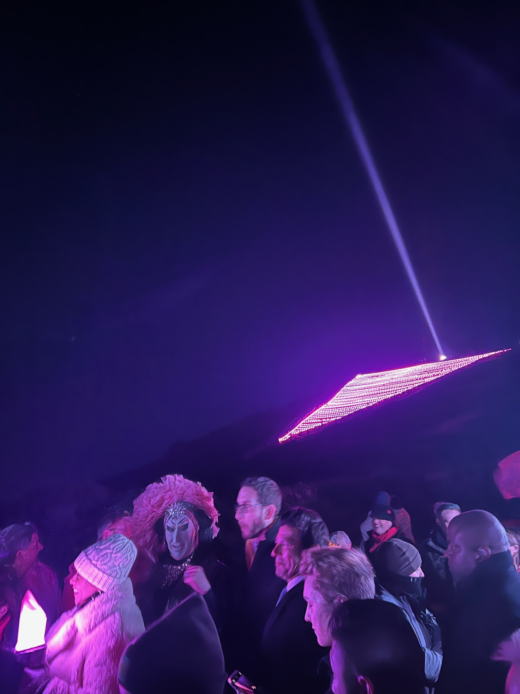
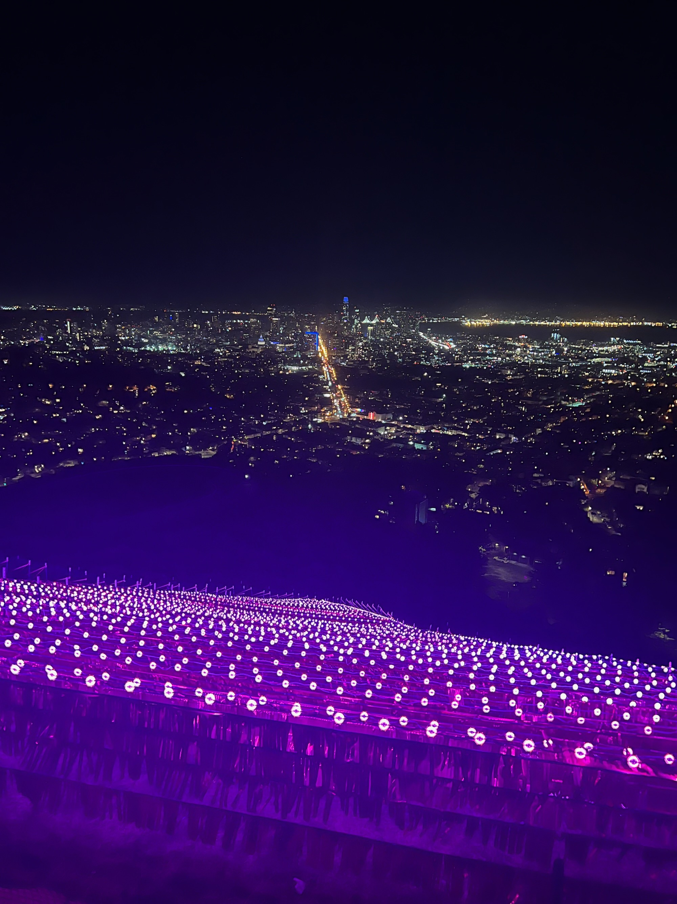

In 2022, I had the privilege of leading the project management for the Pink Triangle installation,
which was beautifully lit with reflective streamers. This project was a powerful symbol of pride and
remembrance, and my role involved coordinating every detail to ensure the installation was both
impactful and visually stunning.

The reflective streamers illuminated the Pink Triangle, creating a striking visual that resonated
deeply with the community. Managing this project allowed me to blend creativity with precision,
resulting in an installation that not only honored the history and significance of the Pink Triangle
but also brought together people in a shared celebration of resilience and unity.

