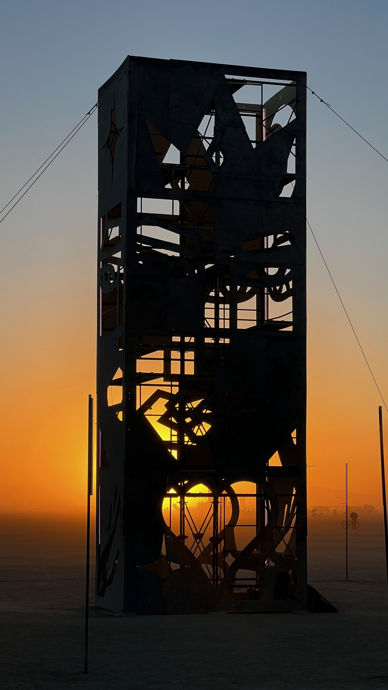
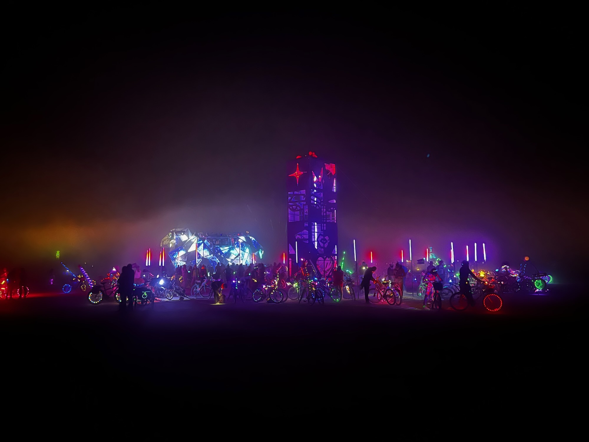

Discover "THEM" - a towering 30-foot art installation, conceived by Simón Malvaez, brought to life
through the craftsmanship of Brenden Darby, and illuminated by myself.

This climbable structure welcomes all to step inside, embodying the art themselves, thereby morphing
the sculpture into a reflection of "THEM."

It's through the communal engagement and the presence of those gathered that the artwork undergoes
its transformation, revealing new identities. As darkness falls, these newfound personas are cast
across the playa, their silhouettes dancing in the light emanating from within.



